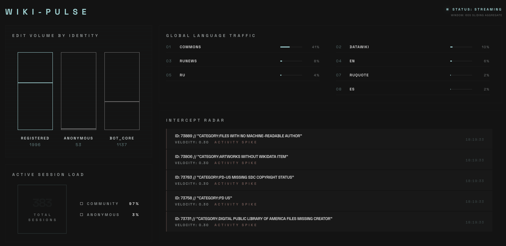

# Wiki-Pulse

A fun, experimental data pipeline project that consumes the live Wikipedia recent-changes feed, processes it using Apache Kafka, and streams real-time metrics to the dashboard via WebSockets.



## What's This For?
This is a showcase reference implementation designed to demonstrate real-time event streaming pipeline. It aggregates thousands of edits from Wikimedia into a high-signal overview of global language traffic and active editor telemetry.

### Tech Stack
- **Ingestion**: Node.js SSE Event streams connected to `stream.wikimedia.org`
- **Queue/Aggregation**: Apache Kafka (handled via an Aiven instance) using `kafkajs`
- **Delivery**: Express.js WebSocket Gateway broadcasting pre-aggregated chunks
- **Frontend**: React + Tailwind CSS + Framer Motion for 60fps animations
- **Testing**: Playwright End-to-End full-stack tests

## Running Locally

1. **Clone the Repo** (The project features a frontend and backend directory).
2. **Setup Environment**:
   Navigate to `/backend` and copy `.env.example` to `.env`. Fill in your Kafka connection string and add your raw multi-line SSL certificates (e.g. from Aiven) into the `KAFKA_CA_PEM`, `KAFKA_CERT_PEM`, and `KAFKA_KEY_PEM` variables.
3. **Install Dependencies**:
   ```bash
   cd backend && npm install
   cd ../frontend && npm install
   ```
4. **Run the Stack**:
   From the root of the project:
   ```bash
   # Starts the UI + Gateway API + Kafka Producers & Aggregators
   npm run dev
   ```
5. **Testing**:
   Run `npm run test:e2e` from the root to run the full-stack Playwright suite.

## Deployment Notes
- **Frontend**: Designed to be easily hosted on Vercel simply by linking the `frontend/` directory.
- **Backend**: Can be deployed to Node-compatible cloud environments (like Northflank) using the provided multi-stage `Dockerfile`. Ensure your cloud platform injects the Kafka certificates securely as raw environment variables.
